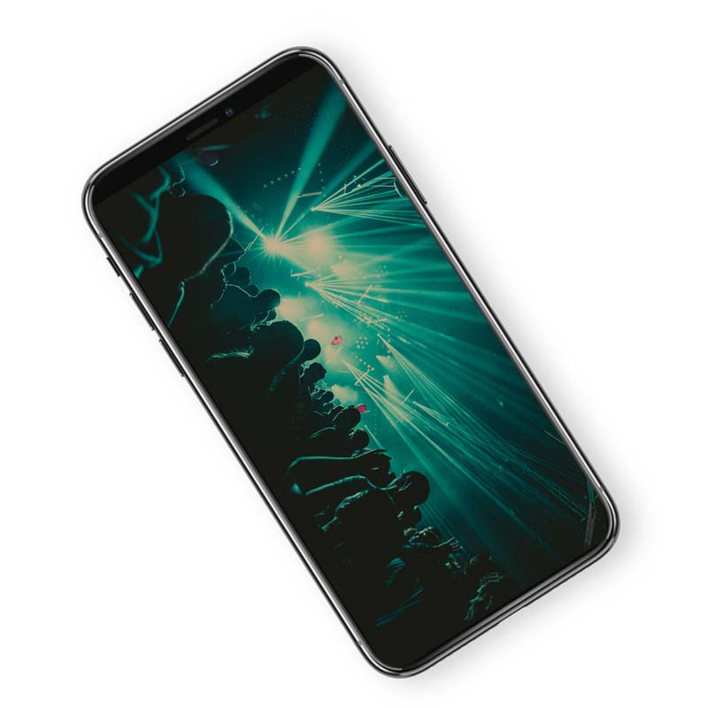

# 

## Introduction
[Streamaxia OpenSDK](https://www.streamaxia.com/opensdk-ios-rtmp-library/) is an easy to integrate, low-latency live video streaming library for iOS and Android mobile apps. Open live video broadcast – not limited to any specific CDN, RTMP Media Server or proprietary protocols. Drag, Drop & Go Live on Facebook, YouTube, Twitch, Twitter, Microsoft Azure, Adobe Media Server, Wowza, Red5, Sewise and more!

This is a short programming guide about how to test Streamaxia OpenSDK library using our demo iOS project.

[Try and order Streamaxia OpenSDK today!](https://www.streamaxia.com/opensdk-pricing/)

## iOS Demo Project Installation:

- Clone the repository on your computer
- Update code signing to match your team in the General pane of the project editor
- Inside AGViewController.m set your desired stream name
```
// Modify this to your desired stream name
NSString * const kStreamaxiaStreamName = @"YOUR-STREAM-NAME-HERE";
```
Build and run the project. You can view your broadcast at the following url: http://play.streamaxia.com/streamaxia/yourStreamName  
Note: You have to build and run the project on a physical device, because streaming is not possible from the simulator

For more information about the Streamaxia Open SDK set up please check [Streamaxia iOS Open SDK Setup Guide](files/OpenSDK_iOS_3.2.pdf)

## Terms
By using this software, you agree the terms specified in the Licensing Agreement represented by the [License Agreement](LICENSE.md)

 **NOTE:** Depending on your license type, each device that has this software running could be limited to a specific amount of streaming hours. 

For example, in this demo app, all the users that use the app will be able to broadcast for 1 hour/month. 

Once the limit is reached, the library will return an AXWarning with code 2001 and will just stop the live streaming feature, without crashing the app. 

The counter is reset every month on the 1st.


## Help and Support

- Mo-Fri 9AM-5PM EET

- support@streamaxia.com

## Resources

- [Streamaxia site](https://www.streamaxia.com/)

- [Streamaxia iOS Open SDK Setup Guide](files/OpenSDK_iOS_3.2.pdf)

- [BroadcastMe App page](https://www.streamaxia.com/broadcastme-whitelabel-app/)

- [BroadcastMe iOS App](https://itunes.apple.com/us/app/broadcast-me/id491982406)

- [BroadcastMe Android App](https://play.google.com/store/apps/details?id=com.streamaxia.broadcastme)

- [Streamaxia Blog](https://medium.com/streamaxia)


<!-- display the social media buttons in your README -->

[![alt text][1.1]][1]
[![alt text][2.1]][2]
[![alt text][6.1]][6]


<!-- links to social media icons -->
<!-- no need to change these -->

<!-- icons with padding -->

[1.1]: http://i.imgur.com/tXSoThF.png (twitter icon with padding)
[2.1]: http://i.imgur.com/P3YfQoD.png (facebook icon with padding)
[6.1]: http://i.imgur.com/0o48UoR.png (github icon with padding)

<!-- icons without padding -->

[1.2]: http://i.imgur.com/wWzX9uB.png (twitter icon without padding)
[2.2]: http://i.imgur.com/fep1WsG.png (facebook icon without padding)
[6.2]: http://i.imgur.com/9I6NRUm.png (github icon without padding)


<!-- links to your social media accounts -->
<!-- update these accordingly -->

[1]: https://twitter.com/streamaxia
[2]: https://facebook.com/streamaxia
[6]: http://www.github.com/streamaxia
